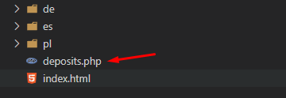
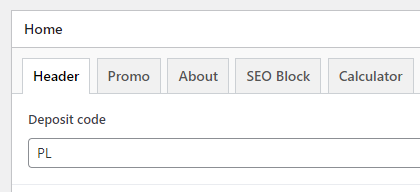
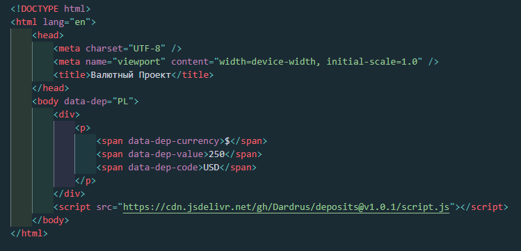
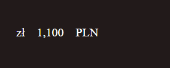
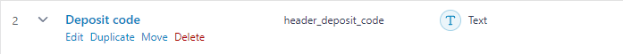

# deposits.js

`deposits.js` - это JavaScript-код, предназначеный для автоматизации процесса установки минимального депозита на сайте.

## Подключение на вашу веб-страницу

Добавьте следующий код перед закрывающим тегом `</body>` на вашем сайте:

```html
<script src="https://cdn.jsdelivr.net/gh/Dardrus/deposits@v1.0.1/script.js"></script>
```
Добавьте файл `deposit-php` в корень вашего проекта



## Использование

Для тега `<body>` установить специальный атрибут `data-dep=""`, с кодом страны или же оставьте пустым для использования дефолтных значений из таблицы.

```html
data-dep=""
``` 

В админке WP выделено специальное поле, находится во вкладке header и имеет название `Deposit code`, установите в него код страны




### В тексте используйте следующие теги:

Для знака валюты:
```html
<span data-dep-currency>$</span>
``` 

Для суммы:
```html
<span data-dep-value>250</span>
``` 

Для кода валюты:
```html
<span data-dep-code>USD</span>
```

### Пример использования для Польши
Что мы заполняем в коде:



Что увидит пользователь:



## Для WordPress

через ACF необходимо вывести поле с названием `Deposit code` во вкладке header



### фрагмент кода на PHP

```php
<?php
  $home_id = get_option('page_on_front');
  $header_deposit_code = get_field('header_deposit_code', $home_id);
?>
```

```php
data-dep="<?= $header_deposit_code  ?>"
```
