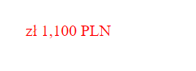

# deposits.js

`deposits.js` - это JavaScript-код, предназначеный для автоматизации процесса установки минимального депозита на сайте.

## Подключение на вашу веб-страницу

Добавьте следующий код перед закрывающим тегом `</body>` на вашем сайте:

```html
<script src="https://cdn.jsdelivr.net/gh/Dardrus/deposits@v1.0.1/script.js"></script>
```
Добавьте файл `deposit-php` в корень вашего проекта


## Использование

Для тега `<body>` установить специальный атрибут `data-dep=""`, с кодом страны или же оставить пустым для использования дефолтных значений из таблицы
```html
data-dep=""
``` 

### В тексте используйте следующие теги:

Для знака валюты:
```html
<span data-dep-currency>$</span>
``` 

Для суммы:
```html
<span data-dep-value>250</span>
``` 

Для кода валюты:
```html
<span data-dep-code>USD</span>
```

### Пример использования для Польши
Что мы заолняем в коде:



Что увидит пользователь:


